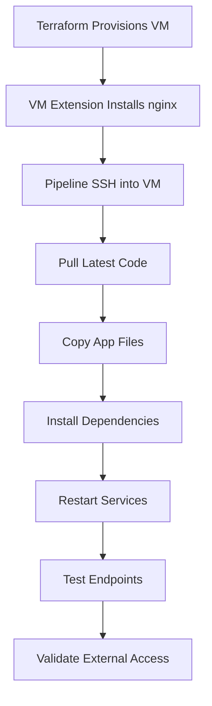

# Application Deployment Guide

This guide explains how to deploy your Python Flask application to Azure VM using nginx after the infrastructure is provisioned.

## Pipeline Overview

The Azure DevOps pipeline now includes the following stages:

1. **Validate** - Validates code and generates SSH keys
2. **Deploy** - Provisions Azure infrastructure using Terraform
3. **Deploy_Application** - 🆕 **NEW STAGE** - SSHs into VM and deploys the application
4. **Validate_Deployment** - Tests the deployed application
5. **Cleanup** - (Optional) Cleans up resources

## New Deploy_Application Stage

The new `Deploy_Application` stage performs the following actions:

### 1. SSH Connection Setup
- Downloads SSH keys generated in the Validate stage
- Establishes SSH connection to the provisioned VM
- Verifies connectivity before proceeding

### 2. VM Initialization Wait
- Waits for the Terraform VM extension script to complete
- Ensures nginx is installed and running
- Provides up to 15 minutes for VM setup completion

### 3. Application Deployment
- Pulls latest code from the repository
- Copies application files from `sample-python-app/` to the app directory
- Updates Python dependencies using pip
- Restarts the application service (supervisor/systemctl)
- Reloads nginx configuration
- Tests application endpoints locally on the VM

### 4. External Validation
- Tests application accessibility from outside the VM
- Validates all API endpoints
- Provides debugging information if deployment fails

## How It Works

### Infrastructure Setup (Terraform)
Your existing Terraform configuration already:
- Installs nginx on the VM
- Sets up the Python environment
- Configures supervisor for process management
- Creates nginx configuration for reverse proxy

### Application Deployment (New Stage)
The new pipeline stage:
- Uses SSH to connect to the VM
- Deploys your application code
- Configures and starts services
- Validates the deployment

## Manual Deployment Script

For quick application updates without running the full pipeline, use the provided `deploy-app.sh` script:

```bash
# Make the script executable
chmod +x deploy-app.sh

# Deploy to your VM
./deploy-app.sh <VM_IP> <SSH_KEY_PATH> [APP_NAME] [ADMIN_USERNAME]

# Examples:
./deploy-app.sh 20.123.45.67 ~/.ssh/id_rsa
./deploy-app.sh 20.123.45.67 ~/.ssh/id_rsa python-flask-app azureuser
```

## Application Structure

Your application should be organized as follows:

```
terraformusecase/
├── sample-python-app/          # Your Flask application
│   ├── app.py                  # Main Flask application
│   ├── requirements.txt        # Python dependencies
│   └── templates/              # HTML templates
├── terraform/                  # Infrastructure code
│   ├── main.tf
│   ├── scripts/setup.sh        # VM initialization script
│   └── modules/
├── azure-pipelines.yml         # CI/CD pipeline
└── deploy-app.sh              # Manual deployment script
```

## Nginx Configuration

The VM setup script creates an nginx configuration that:
- Listens on port 80
- Proxies requests to your Flask app running on port 5000
- Handles static files
- Provides health check endpoint

## Service Management

Your application runs as a service managed by:
- **Supervisor** - Primary process manager
- **Systemd** - Backup service management
- **Nginx** - Web server and reverse proxy

## Monitoring and Debugging

### Check Application Status
```bash
# SSH into the VM
ssh azureuser@<VM_IP>

# Check application service
sudo supervisorctl status python-flask-app
# OR
sudo systemctl status python-flask-app

# Check nginx status
sudo systemctl status nginx

# View application logs
sudo tail -f /var/log/python-flask-app.log

# View nginx logs
sudo tail -f /var/log/nginx/access.log
sudo tail -f /var/log/nginx/error.log
```

### Health Check Endpoints
- **Application Health**: `http://<VM_IP>/health`
- **Home Page**: `http://<VM_IP>/`
- **System Info**: `http://<VM_IP>/api/info`
- **API Test**: `http://<VM_IP>/api/hello?name=Test`

### VM Status Script
The VM includes a status script for easy monitoring:
```bash
ssh azureuser@<VM_IP>
./status.sh
```

## Deployment Process Flow



## Troubleshooting

### Common Issues

1. **SSH Connection Failed**
   - Check VM is running: `az vm list --resource-group <RG_NAME>`
   - Verify SSH key permissions: `chmod 600 ~/.ssh/id_rsa`
   - Check NSG rules allow SSH (port 22)

2. **Application Not Starting**
   - Check application logs: `sudo tail -20 /var/log/python-flask-app.log`
   - Verify Python dependencies: `cd /home/azureuser/python-flask-app && source venv/bin/activate && pip list`
   - Test application import: `python -c "import app"`

3. **Nginx Not Serving**
   - Test nginx config: `sudo nginx -t`
   - Check nginx status: `sudo systemctl status nginx`
   - Verify port 80 is open: `sudo netstat -tlnp | grep :80`

4. **External Access Failed**
   - Check NSG rules allow HTTP (port 80)
   - Verify nginx is proxying to Flask: `curl http://localhost:5000/health`
   - Check firewall: `sudo ufw status`

### Debug Commands

```bash
# Full system status
ssh azureuser@<VM_IP> './status.sh'

# Manual health check
ssh azureuser@<VM_IP> 'cd /home/azureuser/python-flask-app && ./health_check.sh'

# Restart all services
ssh azureuser@<VM_IP> 'sudo supervisorctl restart python-flask-app && sudo systemctl reload nginx'
```

## Security Considerations

- SSH keys are generated per build and stored securely
- VM uses key-based authentication (no passwords)
- Firewall (ufw) is configured to allow only necessary ports
- Application runs as non-root user
- Nginx handles external traffic and proxies to Flask

## Next Steps

1. **Custom Domain**: Configure a custom domain and SSL certificate
2. **Load Balancer**: Add Azure Load Balancer for high availability
3. **Database**: Add Azure Database for PostgreSQL/MySQL
4. **Monitoring**: Integrate with Azure Monitor and Application Insights
5. **Backup**: Implement automated backup strategies

## Support

For issues with the deployment:
1. Check the Azure DevOps pipeline logs
2. SSH into the VM and check service status
3. Review application and nginx logs
4. Use the provided debugging commands
