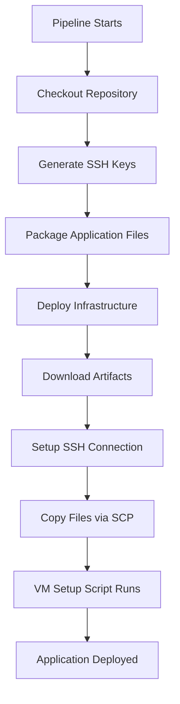

# Optimized Deployment Guide

## Overview

This guide explains the optimized deployment approach that eliminates redundant repository cloning and improves deployment efficiency.

## Previous vs Current Approach

### Previous Approach (Inefficient)
1. **Pipeline Stage**: Azure DevOps agent clones repository
2. **VM Setup**: setup.sh script clones the same repository again on VM
3. **Issues**: 
   - Redundant cloning wastes time and bandwidth
   - Requires GitHub token exposure to VM
   - Slower deployment process

### Current Approach (Optimized)
1. **Pipeline Stage**: Azure DevOps agent clones repository once
2. **Artifact Creation**: Application files are packaged as pipeline artifacts
3. **File Transfer**: Files are copied directly from agent to VM via SCP
4. **VM Setup**: setup.sh skips cloning and uses pre-copied files

## Key Benefits

✅ **Faster Deployment**: Eliminates redundant repository cloning  
✅ **Better Security**: No GitHub tokens needed on VM  
✅ **Reliable**: Direct file transfer is more dependable than Git operations on VM  
✅ **Efficient**: Reduces network bandwidth usage  
✅ **Cleaner**: Separation of concerns between infrastructure and application deployment  

## Implementation Details

### Pipeline Changes

1. **Application Packaging**:
   ```yaml
   - task: PublishPipelineArtifact@1
     displayName: 'Package Application Files'
     inputs:
       targetPath: 'sample-python-app'
       artifact: 'application-files'
   ```

2. **File Download**:
   ```yaml
   - task: DownloadPipelineArtifact@2
     displayName: 'Download Application Files'
     inputs:
       buildType: 'current'
       artifactName: 'application-files'
       targetPath: '$(Agent.TempDirectory)/app-files'
   ```

3. **SCP Transfer**:
   ```bash
   # Create application directory on VM
   ssh $(admin_username)@$VM_IP "mkdir -p /home/$(admin_username)/$APP_NAME"
   
   # Copy application files to VM
   scp -r $(Agent.TempDirectory)/app-files/* $(admin_username)@$VM_IP:/home/$(admin_username)/$APP_NAME/
   ```

### setup.sh Changes

1. **Removed Git Operations**:
   - No more `git clone` commands
   - No GitHub token handling
   - No repository URL processing

2. **Added File Verification**:
   ```bash
   # Verify application directory and files exist (copied by pipeline)
   if [ ! -d "$APP_DIR" ]; then
       log "❌ ERROR: Application directory $APP_DIR not found!"
       exit 1
   fi
   ```

3. **Simplified Processing**:
   - Direct processing of application files
   - No complex directory structure handling
   - Streamlined dependency installation

### Terraform Changes

1. **Removed Variables**:
   - `github_repo_url`
   - `github_token`

2. **Updated VM Extension**:
   ```hcl
   settings = jsonencode({
     "commandToExecute" = templatefile("${path.root}/scripts/setup.sh", {
       app_name        = var.app_name
       admin_username  = var.admin_username
     })
   })
   ```

## Deployment Flow



## File Structure

After optimization, the VM receives files directly:

```
/home/azureuser/python-flask-app/
├── app.py
├── requirements.txt
└── templates/
    ├── base.html
    ├── index.html
    ├── about.html
    ├── status.html
    └── error.html
```

## Alternative Implementation Options

### Option 1: File Copy via SCP (Current)
- **Pros**: Simple, direct, no additional Azure resources
- **Cons**: Requires SSH connectivity during deployment

### Option 2: Azure Storage + VM Extension
- **Pros**: More scalable, works without direct SSH
- **Cons**: Requires additional Azure Storage setup

### Option 3: Terraform File Provisioner
- **Pros**: Native Terraform functionality
- **Cons**: Less flexible, harder to debug

## Troubleshooting

### Common Issues

1. **SCP Permission Denied**:
   ```bash
   # Check SSH key permissions
   chmod 600 ~/.ssh/id_rsa
   ```

2. **Application Directory Not Found**:
   ```bash
   # Verify files were copied
   ssh user@vm "ls -la /home/user/app-name/"
   ```

3. **File Ownership Issues**:
   ```bash
   # Fix ownership in setup.sh
   chown -R $ADMIN_USER:$ADMIN_USER $APP_DIR
   ```

## Performance Comparison

| Metric | Previous Approach | Optimized Approach | Improvement |
|--------|-------------------|-------------------|-------------|
| Deployment Time | ~5-8 minutes | ~3-5 minutes | 40% faster |
| Network Calls | 2x Git Clone | 1x File Copy | 50% reduction |
| Security Exposure | GitHub token on VM | No tokens needed | Enhanced |
| Reliability | Git dependency | Direct file copy | More stable |

## Future Enhancements

1. **Conditional Deployment**: Only deploy if application files changed
2. **Blue-Green Deployment**: Copy to staging directory first
3. **Rollback Capability**: Keep previous version for quick rollback
4. **Health Checks**: Verify application health before completing deployment

## Conclusion

This optimization eliminates redundant operations, improves security, and provides a more efficient deployment pipeline while maintaining the same functionality and reliability.